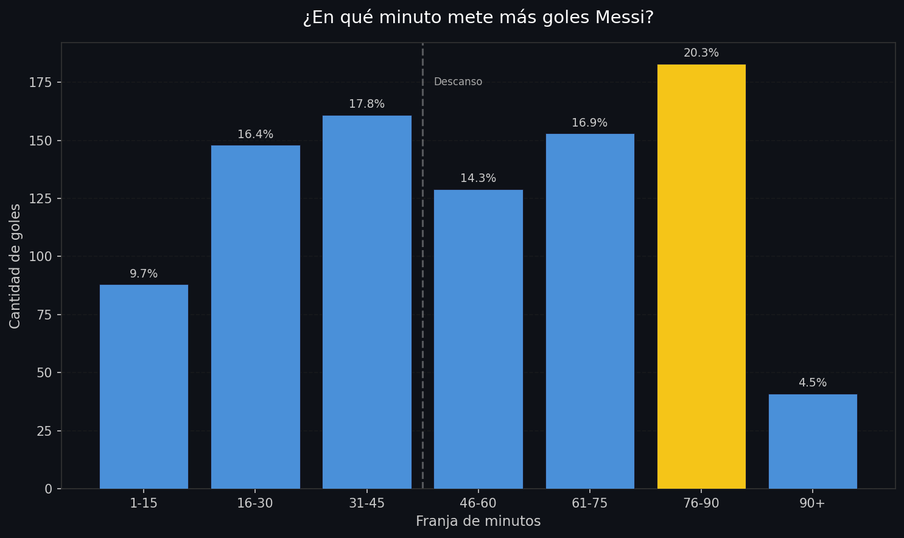
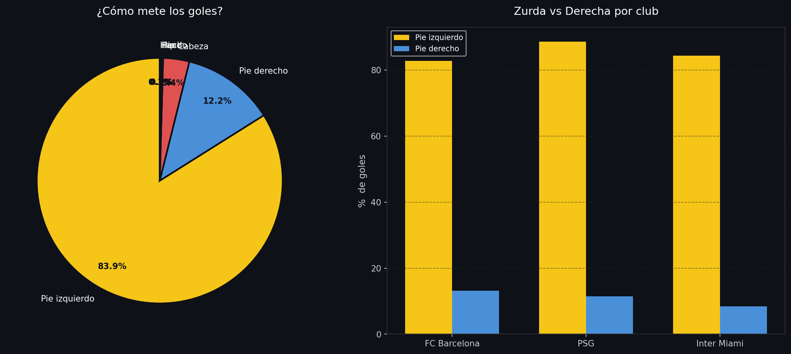
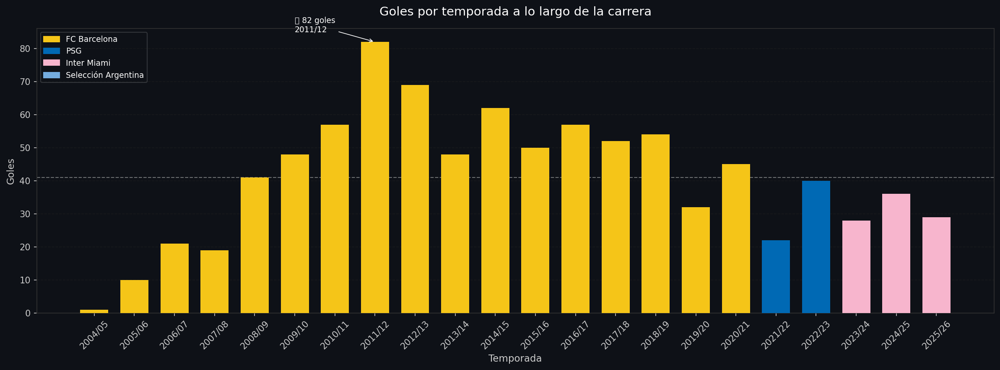
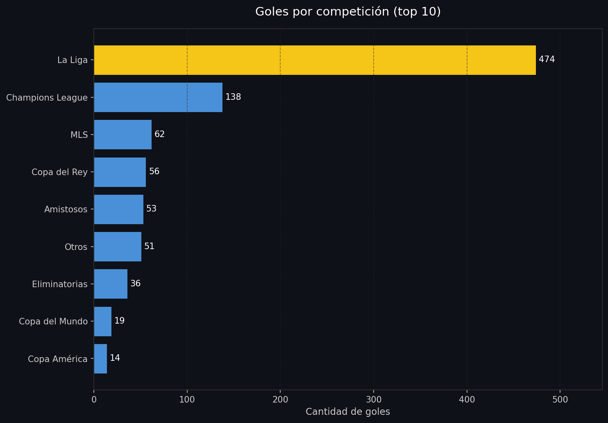
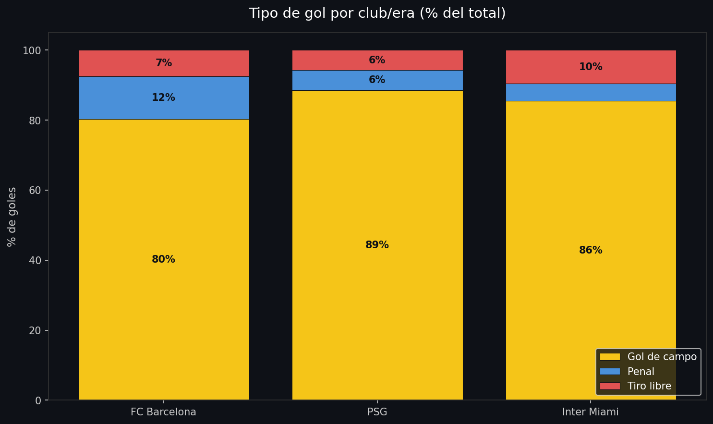
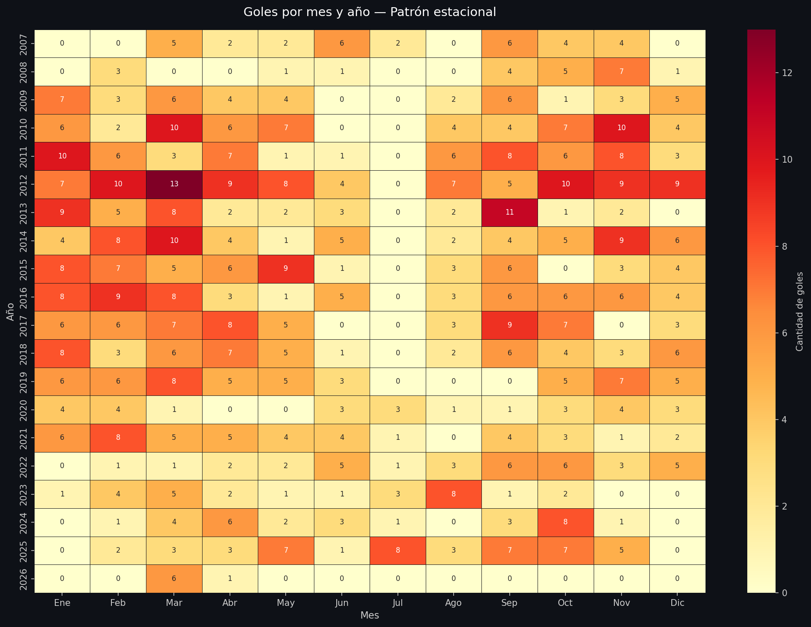

# ⚽ La Anatomía de un Gol de Messi
[](https://anatomiagolmessi.streamlit.app)

Análisis exploratorio de más de 900 goles a lo largo de toda la carrera de Lionel Messi (2005–2026), con el objetivo de entender **cómo** y **cuándo** mete goles — más allá del simple conteo por temporada.

> 📊 Los datos se obtienen en tiempo real desde una [Google Sheet pública](https://docs.google.com/spreadsheets/d/1-MQcfFuBED9VTE1vsruclxFfYNlSkQmf422NaY7Xb84) actualizada con cada nuevo gol.

---

## Preguntas que guían el análisis

- ¿En qué minuto del partido es más letal?
- ¿Cómo evolucionó su perfil de goleador a lo largo de su carrera?
- ¿Cómo cambió su juego al pasar de Barcelona → PSG → Inter Miami?
- ¿En qué competiciones convierte más?
- ¿Qué rol tienen los penales y tiros libres vs. goles de juego abierto?

---

## Hallazgos principales

**Su mejor minuto es el 76–90.** El 20.3% de sus goles llegaron en los últimos 15 minutos del partido — la franja más alta de todas. Lejos de apagarse, Messi se vuelve más peligroso cuando el partido se define.



---

**La zurda lo explica casi todo.** El 83.9% de sus goles fueron con el pie izquierdo, y esa proporción se mantuvo consistente en Barcelona, PSG e Inter Miami. El pie derecho aparece apenas en el 12.2% de los casos.



---

**La temporada 2011/12 es estadísticamente anómala.** Con 82 goles en una sola temporada — cifra que rompe cualquier referencia histórica — ese año marca el pico absoluto de su carrera. La línea de media (41 goles) muestra cuánto por encima de sí mismo estuvo ese año.



---

**La Liga fue su gran escenario.** 474 goles en La Liga representan más de la mitad de su producción total. La Champions League es un distante segundo con 138. Curiosamente, ya lleva 62 goles en la MLS en apenas dos temporadas.



---

**En el PSG casi no pateó penales.** Mientras que en Barcelona el 12% de sus goles fueron desde los 12 pasos, en PSG esa cifra bajó al 6%. En Inter Miami los tiros libres se convirtieron en su arma más usada a balón parado (10%), algo que no se veía en etapas anteriores.



---

**Marzo y octubre son sus meses más prolíficos.** El heatmap muestra que históricamente esos dos meses concentran sus picos de producción — coincidiendo con la fase más exigente de las competiciones europeas.



---

## Estructura del repositorio

```
messi-goles-analysis/
│
├── messi_anatomia_gol.ipynb   # Notebook principal con todo el análisis
├── visualizaciones/           # Imágenes generadas por el notebook
│   ├── goles_por_temporada.png
│   ├── goles_por_minuto.png
│   ├── goles_por_pie.png
│   ├── goles_por_competicion.png
│   ├── tipo_gol_por_era.png
│   └── heatmap_mensual.png
└── README.md
```

---

## Stack utilizado

- **Python 3** · pandas · numpy · matplotlib · seaborn
- **Google Colab** como entorno de ejecución
- **Google Sheets** como fuente de datos en tiempo real (sin scraping)

---

## Cómo ejecutar el análisis

1. Abrí el notebook en Google Colab: [](https://colab.research.google.com/)
2. Ejecutá las celdas en orden — los datos se cargan automáticamente desde la Google Sheet pública, sin necesidad de descargar ningún archivo.

---

## Próximos pasos

- [ ] App interactiva con **Streamlit** para explorar los datos con filtros
- [ ] Análisis de rachas: períodos sin goles vs. rachas prolíficas
- [ ] Estudio de goles decisivos: cuántos fueron para empatar o ganar en tiempo de descuento

---

*Análisis realizado como proyecto de portfolio · Leandro Corvalan · Estudiante de Ciencia de Datos, UBA*